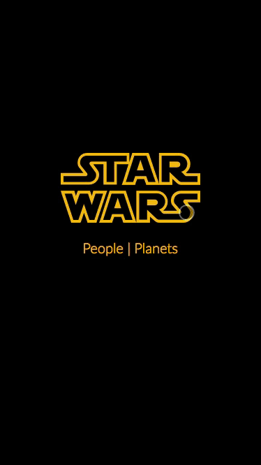

# React/Redux Web App that uses the Star Wars API

A live demo can be found on [this link](https://codesandbox.io/s/github/harlley/grocerylist-react/tree/master/). 

Design and code by [@harlley](https://github.com/harlley)



## Tech Stack

* React
* Redux
* React Router
* Styled Components

## How to Use

To clone and run this application, you'll need [Git](https://git-scm.com) and [Node.js](https://nodejs.org/en/download/) (which comes with [npm](http://npmjs.com)) installed on your computer. From your command line:

```bash
# Clone this repository
$ git clone https://github.com/harlley/star-wars-react-redux

# Go into the repository
$ cd star-wars-react-redux

# Install dependencies
$ npm install

# Run the app
$ npm start
```

## License

MIT

---

> [harlleyoliveira.com.br](http://harlleyoliveira.com.br) &nbsp;&middot;&nbsp;
> GitHub [@harlley](https://github.com/harlley) &nbsp;&middot;&nbsp;
> Twitter [@harlleydev](https://twitter.com/harlleydev)

